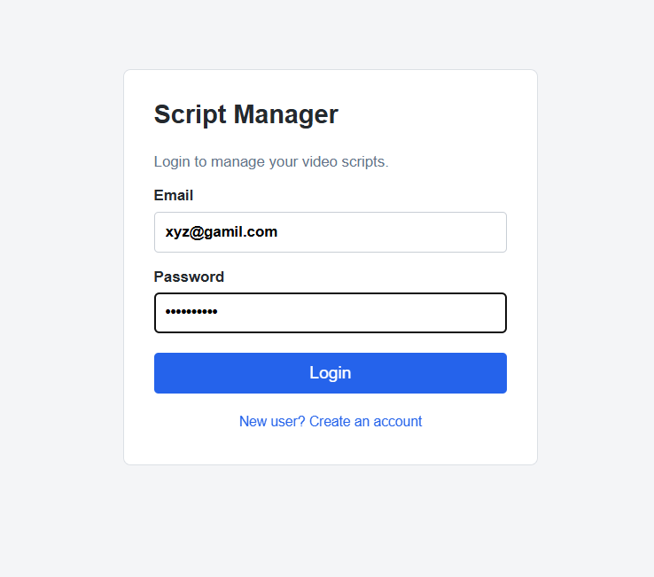
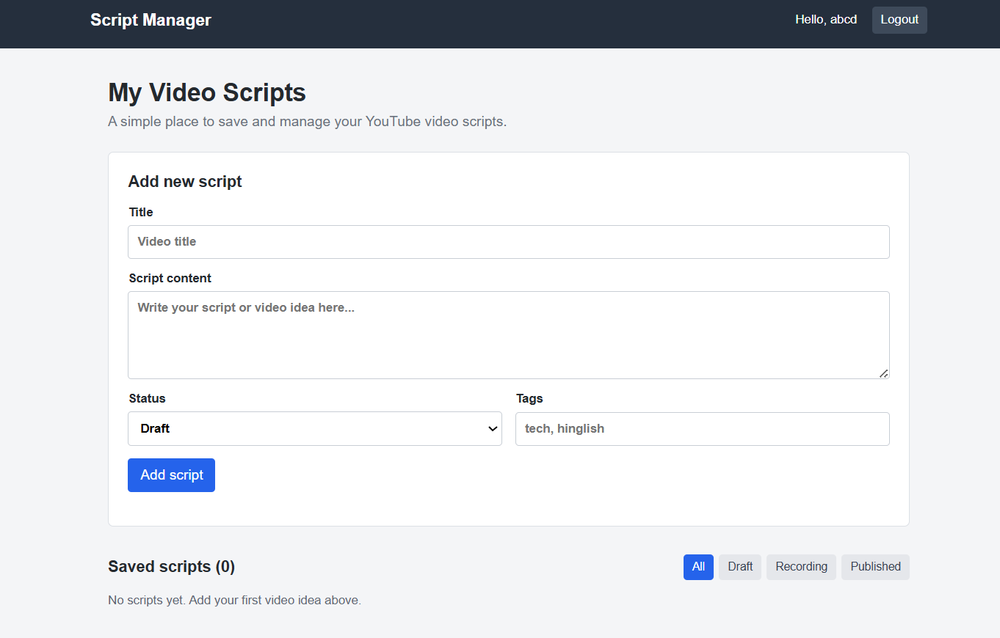

# 🎬 Script Manager

A full-stack MERN application for managing YouTube and video scripts from idea to completion — register, log in, and organize scripts by status in your own private workspace.

🔗 **Live App:** https://video-script-manager-mern.vercel.app/
⚙️ **Backend API:** https://video-script-manager-mern.onrender.com/api
💻 **GitHub Repo:** https://github.com/PriyaKumari2002/Video-script-manager-MERN

> ⏳ Backend is hosted on Render's free tier, so the first request after inactivity may take 30–50 seconds to wake up.

---

## 📸 Screenshots

### 🔐 Login


### 📋 Dashboard


---

## ✨ Features

- 🔑 Register and login with JWT authentication
- 🔒 Private, per-user workspace — each user only sees their own scripts
- ✍️ Add, edit, and delete video scripts
- 📊 Track script status: Draft, Recording, Published
- 🔍 Filter scripts by status
- 🏷️ Add tags like `tech`, `hinglish`, `review`

---

## 🛠️ Tech Stack

| Layer | Technology |
|---|---|
| Frontend | React + Vite |
| Backend | Node.js + Express |
| Database | MongoDB + Mongoose |
| Auth | JWT |
| Backend Hosting | Render |
| Frontend Hosting | Vercel |

---

## 🚀 Run Locally

Install frontend dependencies:

```bash
npm install
npm run dev
```

In a second terminal, start the backend:

```bash
cd server
npm ci
npm run dev
```

Create `server/.env` with your Atlas database connection and a JWT secret of at least 32 characters:

```env
MONGO_URI=
JWT_SECRET=
PORT=5001
CLIENT_URLS=http://localhost:5173
```

---

## ☁️ Deploy

- **Backend:** Render — https://video-script-manager-mern.onrender.com
- **Frontend:** Vercel — https://video-script-manager-mern.vercel.app/
- **Database:** MongoDB Atlas

### 1️⃣ Backend on Render

1. Create a MongoDB Atlas free cluster, create a database user, allow the Render service to access the cluster, and copy the connection string.
2. On Render, create a new Web Service from this GitHub repo.
3. Set root directory to `server`.
4. Build command:
   ```bash
   npm ci
   ```
5. Start command:
   ```bash
   npm start
   ```
6. Environment variables:
   ```env
   MONGO_URI=
   JWT_SECRET=
   NODE_ENV=production
   CLIENT_URLS=
   NODE_VERSION=20
   ```

Use the actual Vercel production URL in `CLIENT_URLS` (currently `https://video-script-manager-mern.vercel.app`). Do not add a trailing slash.

### 2️⃣ Frontend on Vercel

1. Import the same GitHub repo in Vercel.
2. Keep framework as Vite.
3. Build command:
   ```bash
   npm run build
   ```
4. Output directory:
   ```text
   dist
   ```
5. Environment variable:
   ```env
   VITE_API_URL=https://video-script-manager-mern.onrender.com/api
   ```

Set `VITE_API_URL` to the Render backend URL followed by `/api`, then redeploy the Vercel frontend. The Render health endpoint is `/api/health`.

---

## 💼 Resume Bullet

Built and deployed a full-stack MERN video script manager with JWT authentication and CRUD operations for creating, editing, deleting and tracking video scripts by status.

---

⭐ If you found this project useful or interesting, consider giving it a star!
